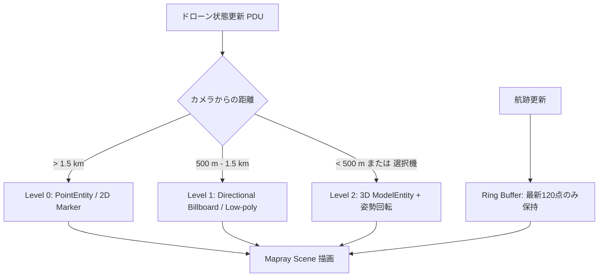

# Mapray × PLATEAU × 箱庭 デモ再計画に対するGeminiレビューおよび発展的提言

作成日: 2026-08-14  
対象文書: `Plan20260814/mapray-plateau-hakoniwa-demo-replan.md` (Codex作成)  
対象ワークスペース: `D:\work_hako\work_mapray`  
対象シナリオ: 東京タワー周辺（600m〜広域）  
評価者: Gemini  

---

## 1. 総括評価（Executive Summary）

Codexが策定した再計画書（`Plan20260814/mapray-plateau-hakoniwa-demo-replan.md`）は、従来の「Mapray=広域、Three.js=局所」という根拠の薄い二項対立を排し、**「配信・描画パイプラインの比較（RENDERING A/B）」**と**「実行主体の比較（MISSION / RUNTIME）」**に明確に分離した点において、極めて論理的で工学的に誠実な優れた計画です。

また、PLATEAUの公式ユースケース（UC20-011, UC23-20）を踏まえた「災害後都市インフラ点検」へのストーリー転換、単独実行による客観的ベンチマーク測定の徹底、Kinematicから段階的にMuJoCo物理へ移行するFidelity戦略など、実現可能性と説得力を大幅に向上させています。

本稿では、Codexの計画の長所を全面的に支持した上で、**「デモを観る相手（クライアント・技術者・ステークホルダー）への訴求力」「Maprayと箱庭の真のシナジー」「Webフロントエンド描画負荷の現実的対策」「限られた開発工数でのリスクヘッジ」**の観点から、さらにデモの価値を最大化するための5つの重点提言と改訂デモ台本を提示します。

---

## 2. 5つの重点提言（Key Recommendations）

### 提言1: 「数字の比較」から「運用インパクトと体験の比較」への昇華
Codex案の「RENDERING A/B」におけるFPSやLong Task、転送量の測定は技術検証として不可欠ですが、デモ本番で数値グラフだけを並べると、オーディエンスにとって退屈かつ地味な印象になりがちです。また、ネットワーク状況やGPU差によってベンチマーク差が僅差だった場合のリスクもあります。

*   **改善提案**:
    *   **「視点移動・LOD遷移の滑らかさ」の体感**: カメラを東京タワー上空から広域へズームアウト/パンさせた時の「タイルのカクつきのなさ（Stutteringフリー）」や「テクスチャの段階的読み込み（Progressive LOD）」を体験させる。
    *   **「動的重畳時の安定性」**: 30機の航跡や危険ポリゴンを表示した状態でカメラを激しく動かしても、Maprayの描画パイプラインが安定してフレームを維持する様子を見せる。

### 提言2: Mapray × 箱庭 ならではの独自価値（Multi-layer Digital Twin）の強調
Maprayの本質的な強みは、単なるWeb 3Dビューワではなく、**「地球楕円体（WGS84）」「DEM標高データ」「3D都市モデル（B3D）」「動的Entityレイヤー」が一体化している点**にあります。一方、箱庭の強みは**「実機・物理シミュレーションと直結したリアルタイムPDU制御」**です。

*   **改善提案**:
    *   **対地高度（AGL: Above Ground Level）と海抜高度（AMSL）のリアルタイム可視化**:
        *   MaprayがDEM標高を持っているため、「ドローンが東京タワー周辺の起伏ある地形や建物から何メートル上空を飛んでいるか」をリアルタイム計算し、危険高度に近づいた際に警告色（赤/黄）へ変える。
        *   これはThree.js単体では標高タイルの事前メッシュ結合が必要で実装が重いが、Maprayならネイティブに実現できる明確な強みとなる。
    *   **時系列ハザード（浸水深・風況）レイヤーの重ね合わせ**:
        *   都市モデル＋地形＋浸水ポリゴン＋ドローン飛行空間が1つの地球座標系上で矛盾なく統合されている姿を示す。

### 提言3: 箱庭コア連携（Hakoniwa Core / PDU）の「自律・動的制御」の演出
Codex案では「コアの停止・再開」でブラウザアニメーションとの違いを示すとしていますが、見た目上は単なる動画の「一時停止・再生ボタン」と誤認される懸念があります。

*   **改善提案**:
    *   **キラー演出: 「動的リルート（Dynamic Reroute / Geofence回避）」**:
        *   デモ中に「東京タワー東側に突風・火災・浸水アラート」を発生させる。
        *   箱庭コア側の運航管理（FMS/UTMロジック）がこれを検知し、飛行中のドローン数機に対して**PDU経由でリアルタイムに回避ウェイポイント指令を送信**する。
        *   Mapray上で該当ドローンの航跡が滑らかに旋回・迂回する様子を見せる。
        *   これにより、「ブラウザが決まった軌道を再生しているのではなく、コアの頭脳がリアルタイムに運航判断を下している」ことが一目で伝わる。
    *   **通信断・フェールセーフ（RTH: Return to Home）の表現**:
        *   特定機体を「Link Lost（通信途絶）」させ、自律的に安全高度まで上昇・母港へ帰還するシーケンスをステータス表示。
    *   **PDU通信ヘルスモニター（PDU Health HUD）**:
        *   画面隅に「Core Time」「Sim RTF (Real Time Factor)」「PDU Packet Rate (Hz)」「Sequence ID」「Latency (ms)」を小さく常時表示し、バックエンドが生きている証拠を視覚化する。

### 提言4: 30〜100機スケーラビリティのための描画最適化（Mapray JS負荷対策）
Mapray JS（特に0.9.6）において、多数の `ModelEntity`（3D GLTF）を毎フレーム座標・姿勢更新すると、WebGL Draw CallやGC（Garbage Collection）のスパイクが発生し、ブラウザが重くなるリスクがあります。

*   **改善提案（Entity LOD & Ring Buffer）**:
    *   **Adaptive Entity LOD**:
        *   **広域・遠距離（> 1.5km）**: 軽量な `PointEntity` または 2D Canvas Marker（ID・状態色のみ）。
        *   **中距離（500m〜1.5km）**: 向きを示す矢印付きビルボード / 低ポリゴン簡易モデル。
        *   **近距離・選択機（< 500m）**: フルディテール 3Dドローンモデル（プロペラ回転・姿勢反映）。
    *   **軌跡（Polyline/Path）の頂点リングバッファ管理**:
        *   全機体の全履歴を保持するとメモリリークの原因になるため、過去N点（例: 直近60秒 / 120点）のリングバッファ構造とし、直近軌跡のみを効率的に更新する。

### 提言5: 比較対象（Three.js / 3D Tiles）の工数対効果とフォールバック設計
Codex案では「PLATEAU 3D Tiles」を比較対象の第一候補としていますが、Three.js環境に完全な3D Tilesローダーを組み込み、同一カメラ同期・同一LOD制御・同一テクスチャ設定を行うのは開発工数がかさむ可能性があります。

*   **改善提案**:
    *   **Phase 1スパイクでの明確な判定基準**:
        *   3D Tilesの実装・調整が3日以内に安定動作しない場合は、即座に「**現在のThree.js直接メッシュ（LOD1/LOD2 OBJ/GLTF）**」を比較対象として確定させる。
        *   その際の説明責任（Attribution/Disclaimer）として、「本比較は、Mapray Cloudの動的タイリング配信と、一般的なWeb3Dにおける事前結合メッシュ一括読み込み方式の特性差を評価したものである」と明記すれば、技術的な公平性と説得力は十分に維持できる。

---

## 3. 改訂デモ台本案（5分間の本番ストーリー）

Codex案をベースに、演出効果と説得力を最大限に高めた5分間のプレゼンテーション構成です。

```text
[0:00 - 1:15] Scene 1: 大規模都市モデルと配信・描画性能 (RENDERING A/B)
  - 東京タワー周辺（600m〜2.4km）のPLATEAU都市モデルを表示。
  - Mapray Cloudによる最適化配信（B3D）と、標準Web配信（3D Tiles/メッシュ）の表示品質・読み込み速度を比較。
  - 事前計測された単独ベンチマーク（FPS中央値、Long Task、転送量）の結果パネルを提示。
  - カメラをパン・ズームさせ、都市モデルのLOD遷移の滑らかさを体感させる。

[1:15 - 2:45] Scene 2: 災害後インフラ緊急点検シナリオ (MISSION / RUNTIME)
  - 「東京タワー周辺・台風/震災後の緊急点検」へシーン切り替え。
  - 防災レイヤ（浸水想定区域・進入禁止エリア・重要点検インフラ）を展開。
  - 30機のドローンが同時出動。Mapray上で全機の航跡・任務ステータス（巡航中/点検中/待機中）がリアルタイムに可視化。
  - 起伏ある地形（DEM）と建物（B3D）に対するドローンの対地高度（AGL）管理を実演。

[2:45 - 4:00] Scene 3: 箱庭コア連携と動的自律運航 (Hakoniwa Core / PDU)
  - 画面隅のPDUヘルスモニター（Core Time, PDU Sequence, RTF）を提示。
  - 【見せ場】緊急ハザード発生イベントを投入（例: ビル屋上からの煙・強風エリアの拡大）。
  - 箱庭コアの運航管理が即座にリルート（迂回指令PDU）を発行し、飛行中の担当機が自動的に危険エリアを回避して飛行経路を変更する様子をMapray上で確認。
  - 1機のドローンで通信断をシミュレートし、フェールセーフ（RTH自律帰還）が発動することを示す。

[4:00 - 4:45] Scene 4: 局所物理シミュレーションとの連動 (Mixed Fidelity)
  - 東京タワー近接点検中の1機をクリック選択。
  - 下段画面にMuJoCo詳細物理（600m環境、構造物との近接センサー、カメラ視点）を表示。
  - 広域の統合運航管理（Mapray）と、局所の高精度物理（MuJoCo）が箱庭PDUを介してシームレスに同期していることを証明。

[4:45 - 5:00] Scene 5: まとめと価値提案
  - 「大容量PLATEAU都市空間を支えるMapray」×「決定論的・高信頼なマルチエージェント物理シミュレーションを担う箱庭」による、次世代都市型エアモビリティ（UTM）デジタルツインプラットフォームの価値を総括。
```

---

## 4. 比較マトリクスと技術仕様

### 4.1 比較モードの整理

| 観点 | モード1: `RENDERING A/B` | モード2: `MISSION / RUNTIME` |
| :--- | :--- | :--- |
| **主目的** | 都市モデルの配信・描画パフォーマンスの技術的証明 | 防災・点検オペレーションにおける業務価値の証明 |
| **上段画面** | Mapray JS (PLATEAU CityGML → B3D) | Mapray JS (統合広域運航画面: 30機 + ハザード + 航跡) |
| **下段画面** | 比較対象 (標準3D Tiles または Three.jsメッシュ) | 選択機のMuJoCo詳細物理画面 / 機載カメラ視点 |
| **ドローン表示** | 同一の簡易シンボル (同一負荷条件) | 距離適応型LOD (Icon → 簡易Model → 詳細Model) |
| **データソース** | 事前計測ベンチマークJSON + 同期カメラ | 箱庭Core (PDUリアルタイム通信) / Browser Standalone |
| **評価指標** | FPS中央値, p95 Frame Time, TTFF, 転送量 | 状況認識性, 指令反映遅延, ジオフェンス回避追従性 |

### 4.2 ドローン描画LOD仕様（Mapray JS）



---

## 5. 実装ロードマップとリスクヘッジ（Go / No-Go 基準）

CodexのPhase 0〜Phase 6をベースに、各段階でのGo/No-Go判断基準とフォールバック策を補強します。

```text
[Phase 0] 差分整理 & ベースライン固定 (工数目安: 0.5日)
  - 未コミット変更の棚卸しとブランチ整理
  - Go条件: テスト全件通過、ビルドクリーン

[Phase 1] 比較可能性 & Mapray機能スパイク (工数目安: 1.5日)
  - 600mデータマニフェスト作成 (SHA-256)
  - 3D Tiles vs Three.jsメッシュの比較実装性評価
  - Mapray 0.9.6での30機Entity更新負荷測定
  - ★Go/No-Go判定:
    - 3D Tilesの安定結合が困難な場合 → Three.js直接メッシュ比較へフォールバック
    - 30機のModelEntityが重い場合 → 提言4のEntity LOD（Point/Marker併用）を採用

[Phase 2] RENDERING A/B & ベンチマーク構築 (工数目安: 1.5日)
  - 単独ベンチマークランナー（自動スクリプト）の実装
  - JSON結果出力と結果パネルUIの作成
  - Go条件: 手順通りに3回実行して再現性のある中央値が取得できること

[Phase 3] MISSION / RUNTIME MVP & PDU連携 (工数目安: 2.0日)
  - 30機Kinematic運航のPDU配信
  - 危険区域ポリゴン、点検対象マーカー、航跡の描画
  - 動的リルート（回避指令）と通信断（RTH）のイベントハンドラ実装
  - Go条件: コア停止・再開・指令変更が画面上に遅延なく反映されること

[Phase 4] 局所詳細（MuJoCo 1機）& 演出ブラッシュアップ (工数目安: 1.5日)
  - 選択した1機のMuJoCo物理詳細（東京タワー近接点検）の上下同期
  - PDUヘルスモニターHUDの統合
  - 台本通りの通しリハーサル

[Phase 5] 最終検証 & ドキュメント (工数目安: 0.5日)
  - 測定レポート（Markdown/JSON）出力
  - スクリーンショット・動画の作成
  - PR作成・マージ判断
```

---

## 6. 結論

Codexが作成した `Plan20260814/mapray-plateau-hakoniwa-demo-replan.md` は、**技術的根拠・比較の公平性・シナリオの現実性の面で非常に完成度が高く、この方針で進めることに全面的に賛同**します。

本提言書で示した**「体験重視の演出（動的リルート・AGL高度管理）」「Entity描画のLOD最適化」「3D Tiles実装のフォールバック設計」**を取り入れることで、デモの説得力と信頼性をさらに盤石なものにできると考えます。

次回作業としては、Codex計画および本提言に基づき、**Phase 0（差分インベントリ整理）**および**Phase 1（600mデータマニフェスト作成と30機描画スパイク）**から着手することを推奨します。
